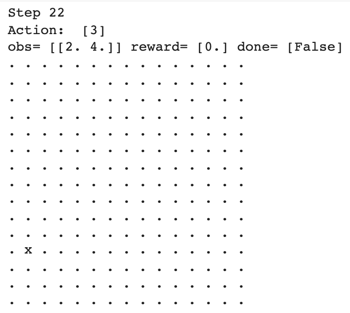
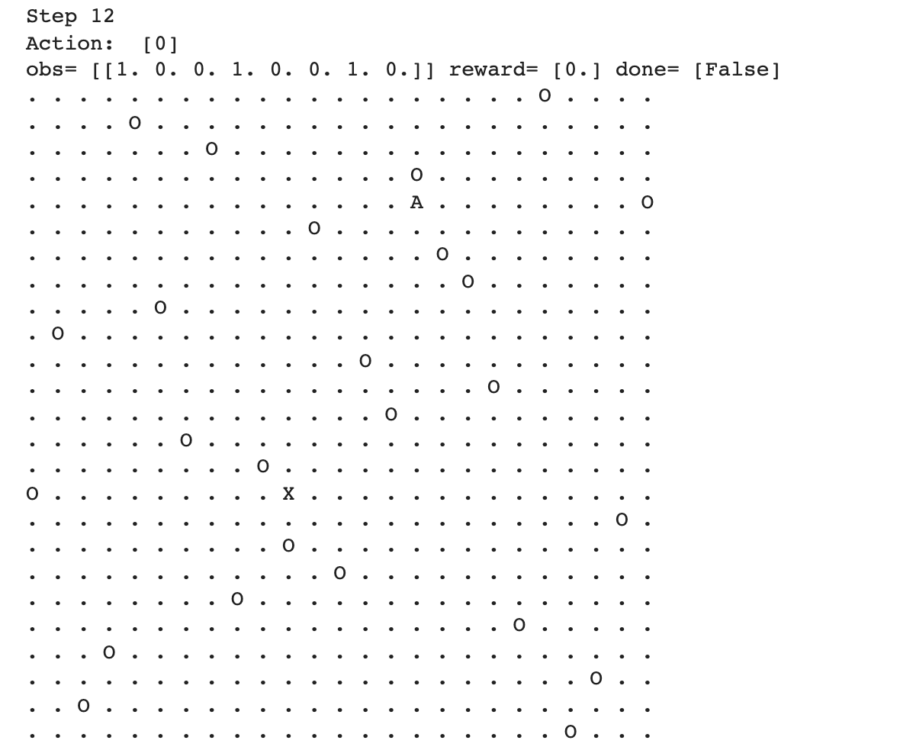

# Reinforcement Learning Playground

A repository devoted to reinforcement learning experimentation. Using Gym and Stable_Baseline3, a series of increasingly complex two dimensional challenges are faced by an agent trained by an actor-critic reinforcement learning algorithm.

The specific algorithm used: https://stable-baselines.readthedocs.io/en/master/modules/a2c.html

## Challenge 1
Agent must learn to navigate to the bottom left corner of a 15x15 grid. Agent represented by (x) and possible positions represented by (.)

## Challenge 2
Agent (x) must learn to navigate to a the bottom left corner of a 20x20 grid (.) with fixed obstacles (O)

## Challenge 3
Agent (A) must learn to navigate through a 25x25 grid (.) to a randomly placed target (X) with randomly placed obstacles (O)

### References

